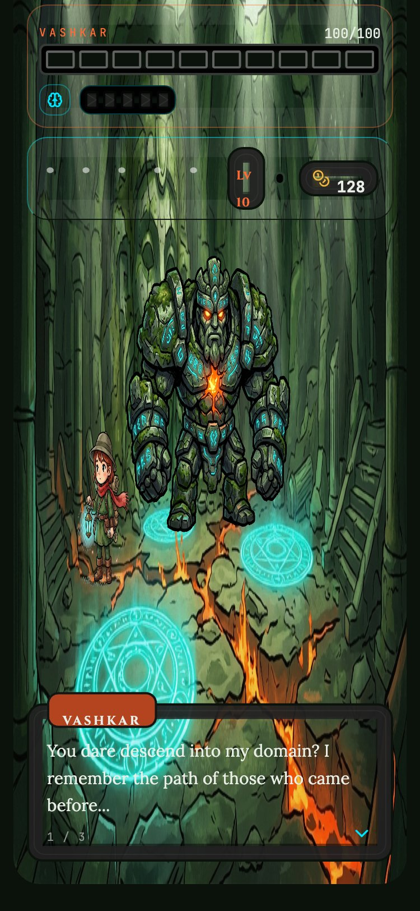
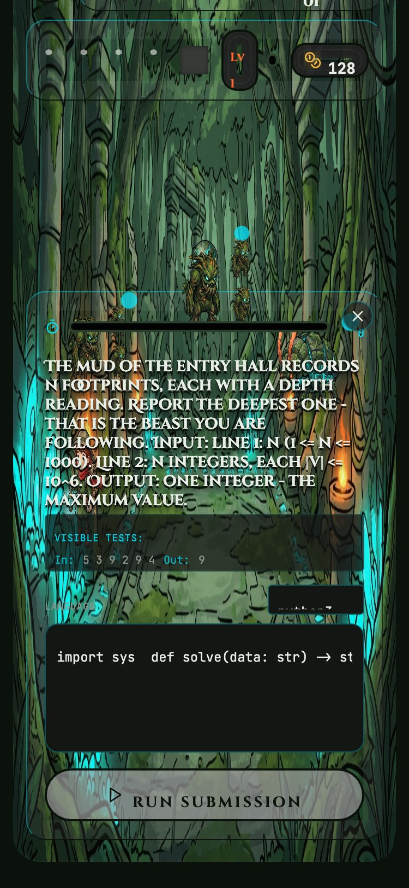
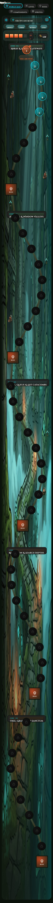

# Dungeon of Recall

**A cognitive memory crawler — descend a 50-floor dungeon whose Boss AI actually *remembers* you, and adapts.**

Built for the Cognee **"Hangover Part AI"** hackathon · Open Source track.

<p align="center">
  
</p>

> *"You dare descend into my domain? I remember the path of those who came before…"*
> — Vashkar, quoting your own recalled history back at you.

---

## The pitch

**Dungeon of Recall** is a single-player DSA/logic/math dungeon crawler where the dungeon master is a self-improving memory. Every question you fail, every wall you inspect, every boss that beats you is written into a per-player knowledge graph — and the dungeon *recalls* that graph to pick your next challenge, taunt you about your weak topics, crack open a hidden side-dungeon when it senses your frustration, and get sharper after every outcome.

Memory is not a feature here, it's the entire mechanic: without persistent, queryable, self-correcting memory there is no game. We use **Cognee** because it gives us the full lifecycle we need in one library — `remember()` to write episodes, `recall()` to query an aggregate profile out of a knowledge graph (not a flat log), `improve()` to consolidate feedback into the graph, and `forget()` for surgical, per-player erasure — all running **self-hosted** on our own Postgres + embedded graph/vector stores, with no managed cloud dependency.

---

## Screenshots

Real captures of the running app (React frontend + FastAPI backend + live Cognee). Backgrounds are slightly flattened in these captures by the screenshot tool; in-app they carry the full gradient/glow lighting.

| | |
|---|---|
|  | **The Boss remembers you.** Vashkar's dialogue is generated from a live `recall()` of your graph — it names the topics and probes you've failed. The brain-gauge under the HP bar is the memory "threat level" derived from your profile. |
|  | **A floor challenge.** Clicking a monster fetches a real question from the self-hosted content bank; you submit code (Python/Java/C/C++) to the self-hosted Piston judge. Every failed hidden-test *probe* (`edge:unbalanced`, `edge:disconnected`, …) becomes a memory episode. |
|  | **The full descent.** 50 numbered floors across five themed zones (Arrays → Trees & Graphs), boss floors every fifth level, plus a hidden dungeon the memory layer can choose to reveal. |

The **memory recall panel** (`COGNEE · MEMORY RECALL — "Vashkar remembers…"`) opens on the boss floor and lists your memory *shards* — weak topics, recurring failure probes, exploration behavior — each traced back to the graph elements it came from. The **Potion of Forgetting** at the bottom of that panel calls `forget()` and visibly empties your memory, re-sealing the hidden dungeon by derivation. *(These two states need a seeded profile to look meaningful; they weren't captured here to avoid contending with the live verification suite running against the same Cognee instance — see the note in the final report.)*

---

## How we use Cognee

The four Cognee verbs map one-to-one onto the four things the dungeon does with you. This is a genuine lifecycle, not four calls bolted on:

| Cognee verb | Where it fires in the game | What actually happens |
|---|---|---|
| **`remember()`** | Every question attempt, wall inspection, whisper, discovery, and boss outcome | An `Episode` (topic, difficulty, `failed_probes`, timing, retries, exploration detail) is written to the player's **own** Cognee dataset (`player_{id}`), cognified into graph nodes + vector embeddings. Concurrent writes are serialized per-player; a local JSONL journal mirrors every episode as an audit trail and offline fallback. |
| **`recall()`** | Before boss dialogue, question selection, the memory sidebar, and *every* hidden-dungeon discovery check | `recall_profile()` runs a `GRAPH_COMPLETION` query over the graph and parses a structured `PlayerProfile`: `weak_topics`, `strong_topics`, `weak_probes`, `frustration`, `explorer_score`. This is a graph *aggregation*, not a keyword lookup — the Boss reasons over relationships, and a nonce defeats stale session-cache answers so a fresh episode always changes the next recall. |
| **`improve()`** | After a fight outcome (the "Boss gets sharper" beat) | `reinforce()` writes the outcome back as a first-class *feedback-correction* episode **and surgically forgets the specific stale episodes it contradicts** (see Known Limitations); `improve()` then runs memify + session feedback-weighting so the consolidation lands in the graph and the *next* `recall()` genuinely reflects the correction. |
| **`forget()`** | The **Potion of Forgetting** | Wipes the player's entire Cognee dataset (graph + vector + session cache). Discovery state is *derived* from the graph, so forgetting also re-seals the hidden dungeon — with **no special-casing**; the re-seal falls out of the same `recall()` returning an empty profile. |

The discovery engine (`backend/game/discovery.py`) is the clearest proof of depth: the hidden dungeon unlock is computed **through** the memory layer on every check — whispers quote your *actual recalled exploration details*, the "mercy crack" opens only when a recalled `frustration` crosses a threshold after repeated boss failures, and `forget()` re-seals it for free. Nothing about discovery is stored in session state; it is all re-derived from `recall()`.

---

## Architecture — fully self-hosted

Everything except the LLM itself runs locally. This targets the **Open Source track**: no managed Cognee Cloud, no paid execution API.

```
                        ┌──────────────────────────────────────────┐
  React (CRA/craco) ──► │  FastAPI backend  (uvicorn :8000)         │
  :3000                 │   backend/game · content · memory · judge │
                        └───────┬───────────────────┬──────────────┘
                                │                   │
                    ┌───────────▼─────────┐  ┌──────▼──────────────┐
                    │  Cognee 1.2.2        │  │  Piston judge       │
                    │  (self-hosted)       │  │  (Docker, :2000)    │
                    │  • Postgres 16 ◄─────┼──┤  Python/Java/C/C++  │
                    │    (relational, Docker) │  no paid API        │
                    │  • ladybug graph ┐   │  └─────────────────────┘
                    │  • lancedb vector ┴─ embedded under            │
                    │                      ./data/cognee (volume)    │
                    └──────────────────────┬───────────────────────┘
                                           │  (only cloud call)
                                  ┌────────▼─────────┐
                                  │ AI/ML API gateway │  LLM + embeddings
                                  │ (OpenAI-compatible)│  one provider, one key
                                  └───────────────────┘
```

- **Relational store:** Postgres 16 in Docker (`dor-postgres`).
- **Graph + vector stores:** Cognee's embedded ladybug (graph) and lancedb (vector), volume-mounted under `./data/cognee` so **the Boss remembers across restarts and rebuilds**.
- **Code judge:** self-hosted [Piston](https://github.com/engineer-man/piston) (`dor-piston`), four languages, no paid execution API. Setup in [`backend/judge/README.md`](backend/judge/README.md).
- **LLM + embeddings:** a single OpenAI-compatible gateway (AI/ML API). Keeping both on one provider avoids Cognee's mixed-provider `NoDataError`. This is the only external call; the memory stores are all local.

---

## Run it yourself

Prerequisites: Docker, Python 3.12, Node 18+, and an OpenAI-compatible LLM key (we use [aimlapi.com](https://aimlapi.com)).

```bash
# 1. clone
git clone https://github.com/Kanhaiya76618/The-Algorithmic-Labyrinth.git
cd The-Algorithmic-Labyrinth

# 2. start the self-hosted stores + judge
docker compose up -d postgres piston

# 3. install Piston runtimes ONCE (Piston ships empty) — see backend/judge/README.md
curl -s -XPOST http://127.0.0.1:2000/api/v2/packages -H 'Content-Type: application/json' -d '{"language":"python","version":"3.10.0"}'
curl -s -XPOST http://127.0.0.1:2000/api/v2/packages -H 'Content-Type: application/json' -d '{"language":"java","version":"15.0.2"}'
curl -s -XPOST http://127.0.0.1:2000/api/v2/packages -H 'Content-Type: application/json' -d '{"language":"gcc","version":"10.2.0"}'

# 4. configure — copy the template and fill in your LLM key
cp .env.example .env
#   then edit .env: set LLM_API_KEY (and EMBEDDING_API_KEY if you want a separate one)

# 5. backend
pip install -r requirements.txt
uvicorn backend.main:app --reload         # http://localhost:8000

# 6. frontend (new terminal)
cd frontend
npm install
npm start                                 # http://localhost:3000
```

`MEMORY_BACKEND=cognee` (the default in `.env.example`) uses the real memory layer. Set `MEMORY_BACKEND=fake` for a keyless, Docker-free in-memory stub during UI dev.

**Verify the memory layer is live:**

```bash
python3 scripts/smoke_memory.py                    # go/no-go across all four verbs
python3 scripts/verify_memory_suite.py --mode live # ~55 assertion-level tests
```

---

## Project structure

```
backend/
  game/       run/session state, discovery engine, answer grading, FastAPI routers
  memory/     Cognee integration — the four verbs + API_NOTES.md (verified 1.2.2 findings)
  content/    50-floor question bank + authoring pipeline + loader
  judge/      self-hosted Piston client (Python/Java/C/C++)
  stubs/      keyless in-memory MemoryService fallback
contracts/    frozen shared schemas (Episode, PlayerProfile, Challenge) + interface
frontend/     React (CRA/craco) app — World Map, Level, Boss, memory sidebar
scripts/      smoke_memory.py, smoke_judge.py, verify_memory_suite.py
docker-compose.yml   Postgres + Piston (+ optional containerized backend)
```

---

## Known limitations & honest engineering notes

We treated the memory layer like production code and root-caused what we found. The most interesting finding:

### `improve()` feedback-bite was nondeterministic — and *why* mattered

**Symptom.** After a strong "the player has mastered trees" correction, the recalled profile only sometimes moved `trees` out of `weak_topics`.

**How we proved it.** We ran the *identical* seed + correction through `reinforce()` + `improve()` + `recall()` repeatedly. With **one** prior failure episode it shifted every time; with **multiple** contradicting failures it shifted only ~2 of 3 runs — a reproducible ~2/3 rate on byte-identical input.

**Root cause.** `reinforce()` originally only *added* a correction episode. The stale "failed trees" episodes stayed in the graph, so `recall()`'s `GRAPH_COMPLETION` was asked to resolve *contradictory evidence*, and the LLM's resolution of that contradiction is nondeterministic. It wasn't a bug in our code so much as a graph-density effect we hadn't accounted for.

**The fix (shipped).** `reinforce()` now derives the deterministic `data_id` of each contradicted failure episode (`uuid5(NAMESPACE_OID, md5(text)+user.id+user.tenant_id)`, verified to match Cognee's own id) and **surgically `forget()`s just those graph data-items** — while keeping the JSONL journal entry for audit. With the contradiction removed, the feedback bite is deterministic on focused profiles. On the *dense* full-lifecycle graph (many topics + exploration/discovery episodes), a residual nondeterminism remains: `GRAPH_COMPLETION` over the larger graph is still probabilistic even after deletion. We surface the *deterministic* guarantee (the surgical forget) as what the test asserts, rather than pretending the end-to-end LLM judgment is deterministic when it isn't.

### Other honest notes
- **remember / recall / forget are solid** and covered by `scripts/verify_memory_suite.py`.
- **LLM latency:** our outage guards were tuned to Cognee's measured latency on the gateway (`COGNEE_WRITE_TIMEOUT_S=35s`, `COGNEE_IMPROVE_TIMEOUT_S=120s`) after observing a successful `remember()` at ~16s and a cognify pipeline run at ~21s. `improve()` is LLM-heavy by nature.
- **Cognee 1.2.2 API specifics** we verified against the installed package (custom `LLM_ENDPOINT` routing, `encoding_format` embedding quirk, dataset-per-player isolation instead of multi-tenant auth, the storage-root trap) are documented in [`backend/memory/API_NOTES.md`](backend/memory/API_NOTES.md).

---

## Team, license, hackathon

- **Hackathon:** Cognee **"Hangover Part AI"** — Open Source track.
- **License:** [MIT](LICENSE).
- **Repository:** https://github.com/Kanhaiya76618/The-Algorithmic-Labyrinth

Built with Cognee's self-hosted memory lifecycle, a self-hosted Piston judge, and a lot of graph-debugging at 2am.
